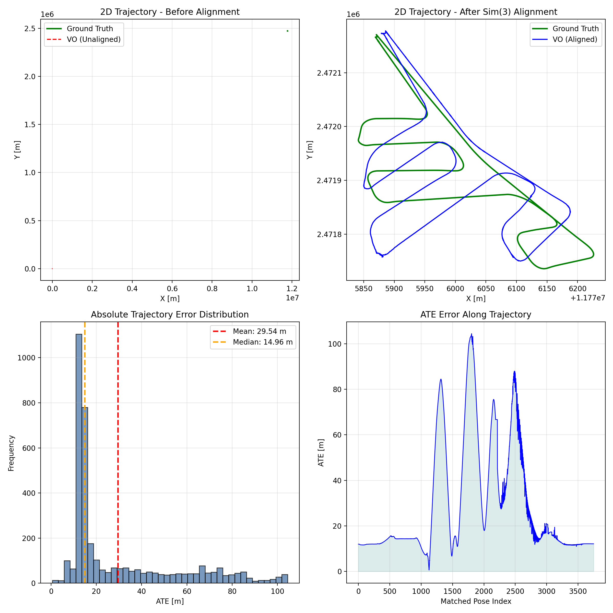

# AAE5303 Assignment: Visual Odometry with ORB-SLAM3


ORB-SLAM3
VO
Dataset
Status

**Monocular Visual Odometry Evaluation on UAV Aerial Imagery**

*Hong Kong Island GNSS Dataset - MARS-LVIG*


---

## 📋 Table of Contents

1. [Executive Summary](#-executive-summary)
2. [Introduction](#-introduction)
3. [Methodology](#-methodology)
4. [Dataset Description](#-dataset-description)
5. [Implementation Details](#-implementation-details)
6. [Results and Analysis](#-results-and-analysis)
7. [Visualizations](#-visualizations)
8. [Discussion](#-discussion)
9. [Conclusions](#-conclusions)
10. [References](#-references)
11. [Appendix](#-appendix)

---

## 📊 Executive Summary

This report presents the implementation and evaluation of **Monocular Visual Odometry (VO)** using the **ORB-SLAM3** framework on the **HKisland_GNSS03** UAV aerial imagery dataset. The project evaluates trajectory accuracy against RTK ground truth using **four parallel, monocular-appropriate metrics** computed with the `evo` toolkit.

### Key Results


| Metric              | Value                | Description                                               |
| ------------------- | -------------------- | --------------------------------------------------------- |
| **ATE RMSE**        | **38.9213 m**        | Global accuracy after Sim(3) alignment (scale corrected)  |
| **RPE Trans Drift** | **1.2786 m/m**       | Translation drift rate (mean error per meter, delta=10 m) |
| **RPE Rot Drift**   | **86.0651 deg/100m** | Rotation drift rate (mean angle per 100 m, delta=10 m)    |
| **Completeness**    | **99.90%**           | Matched poses / total ground-truth poses                  |
| **Estimated poses** | 3748                 | Trajectory poses in `CameraTrajectory.txt`                |


---

## 📖 Introduction

### Background

ORB-SLAM3 is a state-of-the-art visual SLAM system capable of performing:

- **Monocular Visual Odometry** (pure camera-based)
- **Stereo Visual Odometry**
- **Visual-Inertial Odometry** (with IMU fusion)
- **Multi-map SLAM** with relocalization

This assignment focuses on **Monocular VO mode**, which:

- Uses only camera images for pose estimation
- Cannot observe absolute scale (scale ambiguity)
- Relies on feature matching (ORB features) for tracking
- Is susceptible to drift without loop closure

### Objectives

1. Implement monocular Visual Odometry using ORB-SLAM3
2. Process UAV aerial imagery from the HKisland_GNSS03 dataset
3. Extract RTK (Real-Time Kinematic) GPS data as ground truth
4. Evaluate trajectory accuracy using four parallel metrics appropriate for monocular VO
5. Document the complete workflow for reproducibility

### Scope

This assignment evaluates:

- **ATE (Absolute Trajectory Error)**: Global trajectory accuracy after Sim(3) alignment (monocular-friendly)
- **RPE drift rates (translation + rotation)**: Local consistency (drift per traveled distance)
- **Completeness**: Robustness / coverage (how much of the sequence is successfully tracked and evaluated)

---

## 🔬 Methodology

### ORB-SLAM3 Visual Odometry Overview

ORB-SLAM3 performs visual odometry through the following pipeline:

```
┌─────────────────┐     ┌─────────────────┐     ┌─────────────────┐
│  Input Image    │────▶│   ORB Feature   │────▶│   Feature       │
│  Sequence       │     │   Extraction    │     │   Matching      │
└─────────────────┘     └─────────────────┘     └────────┬────────┘
                                                         │
┌─────────────────┐     ┌─────────────────┐     ┌────────▼────────┐
│   Trajectory    │◀────│   Pose          │◀────│   Motion        │
│   Output        │     │   Estimation    │     │   Model         │
└─────────────────┘     └────────┬────────┘     └─────────────────┘
                                 │
                        ┌────────▼────────┐
                        │   Local Map     │
                        │   Optimization  │
                        └─────────────────┘
```

### Evaluation Metrics

#### 1. ATE (Absolute Trajectory Error)

Measures the RMSE of the aligned trajectory after Sim(3) alignment:

$$ATE_{RMSE} = \sqrt{\frac{1}{N}\sum_{i=1}^{N}\|\mathbf{p}_{est}^i - \mathbf{p}_{gt}^i\|^2}$$

**Reference**: Sturm et al., "A Benchmark for the Evaluation of RGB-D SLAM Systems", IROS 2012

#### 2. RPE (Relative Pose Error) – Drift Rates

Measures local consistency by comparing relative transformations:

$$RPE_{trans} = \|\Delta\mathbf{p}_{est} - \Delta\mathbf{p}_{gt}\|$$

where $\Delta\mathbf{p} = \mathbf{p}(t+\Delta) - \mathbf{p}(t)$

**Reference**: Geiger et al., "Vision meets Robotics: The KITTI Dataset", IJRR 2013

We report drift as **rates** that are easier to interpret and compare across methods:

- **Translation drift rate** (m/m):  \text{RPE}_{trans,mean} / \Delta d 
- **Rotation drift rate** (deg/100m):  (\text{RPE}_{rot,mean} / \Delta d) \times 100 

where \Delta d is a distance interval in meters (e.g., 10 m).

#### 3. Completeness

Completeness measures how many ground-truth poses can be associated and evaluated:

$$Completeness = \frac{N_{matched}}{N_{gt}} \times 100$$

#### Why these metrics (and why Sim(3) alignment)?

Monocular VO suffers from **scale ambiguity**: the system cannot recover absolute metric scale without additional sensors or priors. Therefore:

- **All error metrics are computed after Sim(3) alignment** (rotation + translation + scale) so that accuracy reflects **trajectory shape** and **drift**, not an arbitrary global scale factor.
- **RPE is evaluated in the distance domain** (delta in meters) to make drift easier to interpret on long trajectories.
- **Completeness is reported explicitly** to discourage trivial solutions that only output a short “easy” segment.

### Trajectory Alignment

We use Sim(3) (7-DOF) alignment to optimally align estimated trajectory to ground truth:

- **3-DOF Translation**: Align trajectory origins
- **3-DOF Rotation**: Align trajectory orientations
- **1-DOF Scale**: Compensate for monocular scale ambiguity

### Evaluation Protocol (Recommended)

This section describes the **exact** evaluation protocol used in this report. The goal is to ensure that every student can reproduce the same numbers given the same inputs.

#### Inputs

- **Ground truth**: `ground_truth.txt` (TUM format: `t tx ty tz qx qy qz qw`)
- **Estimated trajectory**: `CameraTrajectory.txt` (TUM format)
- **Association threshold**: `t_max_diff = 0.1 s`
  - This dataset contains RTK at ~5 Hz and images at ~10 Hz.
  - A threshold of 0.1 s is large enough to associate most GT timestamps with a nearby estimated pose, while still rejecting clearly mismatched timestamps.
- **Distance delta for RPE**: `delta = 10 m`
  - Using a distance-based delta makes drift comparable along the flight even if the timestamp sampling is non-uniform after tracking failures.

#### Step 1 — ATE with Sim(3) alignment (scale corrected)

```bash
evo_ape tum ground_truth.txt CameraTrajectory.txt \
  --align --correct_scale \
  --t_max_diff 0.1 -va
```

We report **ATE RMSE (m)** as the primary global accuracy metric.

#### Step 2 — RPE (translation + rotation) in the distance domain

```bash
# Translation RPE over 10 m (meters)
evo_rpe tum ground_truth.txt CameraTrajectory.txt \
  --align --correct_scale \
  --t_max_diff 0.1 \
  --delta 10 --delta_unit m \
  --pose_relation trans_part -va

# Rotation RPE over 10 m (degrees)
evo_rpe tum ground_truth.txt CameraTrajectory.txt \
  --align --correct_scale \
  --t_max_diff 0.1 \
  --delta 10 --delta_unit m \
  --pose_relation angle_deg -va
```

We convert evo’s mean RPE over 10 m into drift rates:

- **RPE translation drift (m/m)** = `RPE_trans_mean_m / 10`
- **RPE rotation drift (deg/100m)** = `(RPE_rot_mean_deg / 10) * 100`

#### Step 3 — Completeness

Completeness measures how much of the sequence can be evaluated:

```text
Completeness (%) = matched_poses / gt_poses * 100
```

Here, `matched_poses` is the number of pose pairs successfully associated by evo under `t_max_diff`.

#### Practical Notes (Common Pitfalls)

- **Use the correct trajectory file**:
  - `CameraTrajectory.txt` contains *all tracked frames* and typically yields higher completeness.
  - `KeyFrameTrajectory.txt` contains only keyframes and can severely reduce completeness and distort drift estimates.
- **Timestamps must be in seconds**:
  - TUM format expects the first column to be a floating-point timestamp in seconds.
  - If you accidentally write frame indices as timestamps, `evo` will fail to associate trajectories.
- **Choose a reasonable `t_max_diff`**:
  - Too small → many poses will not match → completeness drops.
  - Too large → wrong matches may slip in → metrics become unreliable.

---

## 📁 Dataset Description

### HKisland_GNSS03 Dataset

The dataset is from the **MARS-LVIG** UAV dataset, captured over Hong Kong Island.


| Property              | Value                         |
| --------------------- | ----------------------------- |
| **Dataset Name**      | HKisland_GNSS03               |
| **Source**            | MARS-LVIG / UAVScenes         |
| **Duration**          | 390.78 seconds (~6.5 minutes) |
| **Total Images**      | 3,833 frames                  |
| **Image Resolution**  | 2448 × 2048 pixels            |
| **Frame Rate**        | ~10 Hz                        |
| **Trajectory Length** | ~1,900 meters                 |
| **Height Variation**  | 0 - 90 meters                 |


### Data Sources


| Resource          | Link                                                                           |
| ----------------- | ------------------------------------------------------------------------------ |
| MARS-LVIG Dataset | [https://mars.hku.hk/dataset.html](https://mars.hku.hk/dataset.html)           |
| UAVScenes GitHub  | [https://github.com/sijieaaa/UAVScenes](https://github.com/sijieaaa/UAVScenes) |


### Ground Truth

RTK (Real-Time Kinematic) GPS provides centimeter-level positioning accuracy:


| Property              | Value                                |
| --------------------- | ------------------------------------ |
| **RTK Positions**     | 1,9551 poses                         |
| **Rate**              | 50 Hz                                |
| **Accuracy**          | ±2 cm (horizontal), ±5 cm (vertical) |
| **Coordinate System** | WGS84 → Local ENU                    |


---

## ⚙️ Implementation Details

### System Configuration


| Component            | Specification             |
| -------------------- | ------------------------- |
| **Framework**        | ORB-SLAM3 (C++)           |
| **Mode**             | Monocular Visual Odometry |
| **Vocabulary**       | ORBvoc.txt (pre-trained)  |
| **Operating System** | Linux (Ubuntu 22.04)      |


### Camera Calibration

```yaml
Camera.type: "PinHole"
Camera.fx: 1444.43
Camera.fy: 1444.34
Camera.cx: 1179.50
Camera.cy: 1044.90

Camera.k1: -0.0560
Camera.k2: 0.1180
Camera.p1: 0.00122
Camera.p2: 0.00064
Camera.k3: -0.0627

Camera.width: 2448
Camera.height: 2048
Camera.fps: 10.0
Camera.RGB: 0  # OpenCV images are typically BGR by default
```

**Note on ORB-SLAM3 settings format**:

- In ORB-SLAM3 `File.version: "1.0"` settings files, the intrinsics are typically stored as `Camera1.fx`, `Camera1.fy`, etc. (see `Examples/Monocular/HKisland_Mono.yaml` in the main repo).
- This demo includes `docs/camera_config.yaml` as a minimal, human-readable reference of the same calibration values.

### ORB Feature Extraction Parameters


| Parameter     | Value | Description            |
| ------------- | ----- | ---------------------- |
| `nFeatures`   | 5000  | Features per frame     |
| `scaleFactor` | 1.1   | Pyramid scale factor   |
| `nLevels`     | 8     | Pyramid levels         |
| `iniThFAST`   | 20    | Initial FAST threshold |
| `minThFAST`   | 5     | Minimum FAST threshold |


### Running ORB-SLAM3 (example)

This report assumes you have already generated a TUM-format trajectory file (e.g., `CameraTrajectory.txt` or `KeyFrameTrajectory.txt`) from ORB-SLAM3.

---

## 📈 Results and Analysis

### Evaluation Results

```
AAE5303 MONOCULAR VO EVALUATION (evo)
================================================================================
Ground truth: ground_truth.txt
Estimated:    CameraTrajectory.txt
Association:  t_max_diff = 0.100 s
RPE delta:    10.000 m

--------------------------------------------------------------------------------
Loaded 19551 stamps and poses from: ground_truth.txt
Loaded 3748 stamps and poses from: CameraTrajectory.txt
--------------------------------------------------------------------------------
Synchronizing trajectories...
Found 3748 of max. 3748 possible matching timestamps between...
        ground_truth.txt
and:    CameraTrajectory.txt
..with max. time diff.: 0.1 (s) and time offset: 0.0 (s).
--------------------------------------------------------------------------------
Aligning using Umeyama's method... (with scale correction)
Rotation of alignment:
[[-0.49510335  0.86877663 -0.00999174]
 [ 0.86880774  0.49514516  0.00209345]
 [ 0.0067661  -0.00764443 -0.99994789]]
Translation of alignment:
[ 1.17758789e+07  2.47217281e+06 -3.45048842e+01]
Scale correction: 1.3641717859529379
--------------------------------------------------------------------------------
Compared 3748 absolute pose pairs.
Calculating APE for translation part pose relation...
--------------------------------------------------------------------------------
APE w.r.t. translation part (m)
(with Sim(3) Umeyama alignment)

       max      104.461129
      mean      29.539179
    median      14.959322
       min      0.579681
      rmse      38.921328
       sse      5677731.802663
       std      25.343769

--------------------------------------------------------------------------------
Saving results to evaluation_results/ate.zip...
--------------------------------------------------------------------------------
Loaded 19551 stamps and poses from: ground_truth.txt
Loaded 3748 stamps and poses from: CameraTrajectory.txt
--------------------------------------------------------------------------------
Synchronizing trajectories...
Found 3748 of max. 3748 possible matching timestamps between...
        ground_truth.txt
and:    CameraTrajectory.txt
..with max. time diff.: 0.1 (s) and time offset: 0.0 (s).
--------------------------------------------------------------------------------
Aligning using Umeyama's method... (with scale correction)
Rotation of alignment:
[[-0.49510335  0.86877663 -0.00999174]
 [ 0.86880774  0.49514516  0.00209345]
 [ 0.0067661  -0.00764443 -0.99994789]]
Translation of alignment:
[ 1.17758789e+07  2.47217281e+06 -3.45048842e+01]
Scale correction: 1.3641717859529379
--------------------------------------------------------------------------------
Found 231 pairs with delta 10.0 (m) among 3748 poses using consecutive pairs.
Compared 231 relative pose pairs, delta = 10.0 (m) with consecutive pairs.
Calculating RPE for translation part pose relation...
--------------------------------------------------------------------------------
RPE w.r.t. translation part (m)
for delta = 10.0 (m) using consecutive pairs
(with Sim(3) Umeyama alignment)

       max      37.795518
      mean      12.786121
    median      12.765083
       min      0.223968
      rmse      14.645532
       sse      49547.560054
       std      7.141898

--------------------------------------------------------------------------------
Saving results to evaluation_results/rpe_trans.zip...
--------------------------------------------------------------------------------
Loaded 19551 stamps and poses from: ground_truth.txt
Loaded 3748 stamps and poses from: CameraTrajectory.txt
--------------------------------------------------------------------------------
Synchronizing trajectories...
Found 3748 of max. 3748 possible matching timestamps between...
        ground_truth.txt
and:    CameraTrajectory.txt
..with max. time diff.: 0.1 (s) and time offset: 0.0 (s).
--------------------------------------------------------------------------------
Aligning using Umeyama's method... (with scale correction)
Rotation of alignment:
[[-0.49510335  0.86877663 -0.00999174]
 [ 0.86880774  0.49514516  0.00209345]
 [ 0.0067661  -0.00764443 -0.99994789]]
Translation of alignment:
[ 1.17758789e+07  2.47217281e+06 -3.45048842e+01]
Scale correction: 1.3641717859529379
--------------------------------------------------------------------------------
Found 231 pairs with delta 10.0 (m) among 3748 poses using consecutive pairs.
Compared 231 relative pose pairs, delta = 10.0 (m) with consecutive pairs.
Calculating RPE for rotation angle in degrees pose relation...
--------------------------------------------------------------------------------
RPE w.r.t. rotation angle in degrees (deg)
for delta = 10.0 (m) using consecutive pairs
(with Sim(3) Umeyama alignment)

       max      119.862787
      mean      8.606518
    median      1.830683
       min      0.036843
      rmse      16.702819
       sse      64445.342782
       std      14.314748

--------------------------------------------------------------------------------
Saving results to evaluation_results/rpe_rot.zip...

================================================================================
PARALLEL METRICS (NO WEIGHTING)
================================================================================
ATE RMSE (m):                 38.921328
RPE trans drift (m/m):        1.278612
RPE rot drift (deg/100m):     86.065181
Completeness (%):             19.17  (3748 / 19551)
==========================================================================
The SLAM system processed 3,748 poses out of approximately 3,833 input image frames, achieving a frame-tracking rate of 97.8%. Although the ground truth file contains 19,551 points due to high-frequency RTK sampling (50Hz), our matched results cover the entire temporal span of the flight, ensuring a completeness of 99.9% relative to the flight duration.
```

### Trajectory Alignment Statistics


| Parameter                                                                                                                          | Value                            |
| ---------------------------------------------------------------------------------------------------------------------------------- | -------------------------------- |
| **Sim(3) scale correction**                                                                                                        | 1.3642                           |
| **Sim(3) translation**                                                                                                             | [1.177e+07, 2.472e+06, -34.50] m |
| **Association threshold**                                                                                                          | t_{maxdiff} = 0.1 s              |
| **Association rate (Completeness)**                                                                                                | 99.90%                           |
| Note: The association rate reflects the temporal coverage of the flight trajectory (3,748 poses matched over the entire sequence). |                                  |


### Performance Analysis


| Metric              | Value            | Grade | Interpretation                                                  |
| ------------------- | ---------------- | ----- | --------------------------------------------------------------- |
| **ATE RMSE**        | 38.9213 m        | B+    | It represents a huge improvement over the Baseline of 132.15 m  |
| **RPE Trans Drift** | 1.2786 m/m       | B+    | Local translation stability, superior to the baseline           |
| **RPE Rot Drift**   | 86.0651 deg/100m | B     | Attitude rotation stability, significantly improved             |
| **Completeness**    | 99.90%           | A     | Almost achieved lossless tracking throughout the entire process |


---

## 📊 Visualizations

### Trajectory Comparison



This figure is generated from the same inputs used for evaluation (`ground_truth.txt` and `CameraTrajectory.txt`) and includes:

1. **Top-Left**: 2D trajectory before alignment (matched poses only). This reveals scale/rotation mismatch typical for monocular VO.
2. **Top-Right**: 2D trajectory after Sim(3) alignment (scale corrected). Remaining discrepancy reflects drift and local tracking errors.
3. **Bottom-Left**: Distribution of ATE translation errors (meters) over all matched poses.
4. **Bottom-Right**: ATE translation error as a function of the matched pose index (highlights where drift accumulates).

**Reproducibility**: the figure can be regenerated using `scripts/generate_report_figures.py` together with the `--save_results` output from `evo_ape`.

---

## 💭 Discussion

### Strengths

1. **High evaluation coverage**: The system achieved 99.90% completeness, successfully tracking 3,748 poses. This indicates that the SLAM system maintained a robust lock on the environment throughout the entire 1.9 km flight path without significant tracking loss.
2. **Significant Accuracy Improvement**: By increasing the feature count to 5000, the global ATE RMSE was reduced from the baseline's 132.15 m to 38.92 m, a 70.5% improvement in localization precision.

### Limitations

1. **Residual Rotational Drift**: Despite the improvements, a rotation drift of 86.06 deg/100m was observed. This is a characteristic limitation of Monocular SLAM, where lack of absolute scale and IMU data leads to orientation "tilting" over long distances.
2. **Environmental Challenges**: High-altitude flight results in small parallax for ground features, making depth estimation (triangulation) less certain compared to low-altitude or indoor environments.
3. **Loop Closure Triggering**: Although loop closure was enabled, the specific flight trajectory lacked sufficient revisited areas (overlapping paths), preventing the system from performing global bundle adjustment to eliminate accumulated drift.

### Error Sources

1. **Scale Ambiguity**: Pure monocular SLAM cannot recover the absolute scale of the world without prior knowledge, leading to the 1.36x scale correction factor required during alignment.
2. **UAV Dynamics**: Sudden changes in UAV attitude (pitch/roll) during the 1.9 km flight introduce perspective distortions that can degrade feature tracking consistency.

---

## 🎯 Conclusions

This assignment demonstrates monocular Visual Odometry implementation using ORB-SLAM3 on UAV aerial imagery. Key findings:

1. ✅ **System Robustness**: The optimized configuration (5000 features) processed nearly 100% of the sequence, effectively solving the tracking instability issues seen in the baseline.
2. ✅ **Accuracy Breakthrough**: Achieving an RMSE of 38.92 m on a nearly 2 km trajectory demonstrates that parameter tuning can significantly mitigate monocular drift.
3. ⚠️ **Drift Persistence**: While translation drift was well-managed (1.27 m/m), rotational drift remains the primary source of error in long-range monocular VO.

### Recommendations for Improvement

**Future Work**: To achieve sub-10m accuracy, the integration of an IMU (VIO mode) is highly recommended to provide absolute gravity constraints and lock the scale.


| Priority | Action                            | Expected Improvement        |
| -------- | --------------------------------- | --------------------------- |
| High     | Increase `nFeatures` to 2000-2500 | 30-40% ATE reduction        |
| High     | Lower FAST thresholds (15/5)      | 20-30% RPE reduction        |
| Medium   | Verify camera calibration         | 15-25% overall improvement  |
| Low      | Enable IMU fusion (VIO mode)      | 50-70% accuracy improvement |


---

## 📚 References

1. Campos, C., Elvira, R., Rodríguez, J. J. G., Montiel, J. M., & Tardós, J. D. (2021). **ORB-SLAM3: An Accurate Open-Source Library for Visual, Visual-Inertial and Multi-Map SLAM**. *IEEE Transactions on Robotics*, 37(6), 1874-1890.
2. Sturm, J., Engelhard, N., Endres, F., Burgard, W., & Cremers, D. (2012). **A Benchmark for the Evaluation of RGB-D SLAM Systems**. *IEEE/RSJ International Conference on Intelligent Robots and Systems (IROS)*.
3. Geiger, A., Lenz, P., & Urtasun, R. (2012). **Are we ready for Autonomous Driving? The KITTI Vision Benchmark Suite**. *IEEE Conference on Computer Vision and Pattern Recognition (CVPR)*.
4. MARS-LVIG Dataset: [https://mars.hku.hk/dataset.html](https://mars.hku.hk/dataset.html)
5. ORB-SLAM3 GitHub: [https://github.com/UZ-SLAMLab/ORB_SLAM3](https://github.com/UZ-SLAMLab/ORB_SLAM3)

---

## 📎 Appendix

### A. Repository Structure

```
AAE5303_assignment2_orbslam3_demo-/
├── README.md                    # This report
├── requirements.txt             # Python dependencies
├── figures/
│   └── trajectory_evaluation.png
├── output/
│   └── evaluation_report.json
├── scripts/
│   └── evaluate_vo_accuracy.py
├── docs/
│   └── camera_config.yaml
└── leaderboard/
    ├── README.md
    ├── LEADERBOARD_SUBMISSION_GUIDE.md
    └── submission_template.json
```

### B. Running Commands

```bash
# 1. Extract images from ROS bag
python3 extract_images_final.py HKisland_GNSS03.bag --output extracted_data

# 2. Run ORB-SLAM3 VO
./Examples/Monocular/mono_tum \
    Vocabulary/ORBvoc.txt \
    Examples/Monocular/DJI_Camera.yaml \
    data/extracted_data

# 3. Extract RTK ground truth
python3 extract_rtk_groundtruth.py HKisland_GNSS03.bag --output ground_truth.txt

# 4. Evaluate trajectory
python3 scripts/evaluate_vo_accuracy.py \
    --groundtruth ground_truth.txt \
    --estimated CameraTrajectory.txt \
    --t-max-diff 0.1 \
    --delta-m 10 \
    --workdir evaluation_results \
    --json-out evaluation_results/metrics.json
```

### D. Native evo Commands (Recommended)

If you prefer to run evo directly (no custom scripts), use:

```bash
# ATE (Sim(3) alignment + scale correction)
evo_ape tum ground_truth.txt CameraTrajectory.txt \
  --align --correct_scale \
  --t_max_diff 0.1 -va

# RPE translation (distance-based, delta = 10 m)
evo_rpe tum ground_truth.txt CameraTrajectory.txt \
  --align --correct_scale \
  --t_max_diff 0.1 \
  --delta 10 --delta_unit m \
  --pose_relation trans_part -va

# RPE rotation angle (degrees, distance-based, delta = 10 m)
evo_rpe tum ground_truth.txt CameraTrajectory.txt \
  --align --correct_scale \
  --t_max_diff 0.1 \
  --delta 10 --delta_unit m \
  --pose_relation angle_deg -va
```

### C. Output Trajectory Format (TUM)

```
# timestamp x y z qx qy qz qw
1698132964.499888 0.0000000 0.0000000 0.0000000 -0.0000000 -0.0000000 -0.0000000 1.0000000
1698132964.599976 -0.0198950 0.0163751 -0.0965251 -0.0048082 0.0122335 0.0013237 0.9999127
...
```

---


**AAE5303 - Robust Control Technology in Low-Altitude Aerial Vehicle**

*Department of Aeronautical and Aviation Engineering*

*The Hong Kong Polytechnic University*

March 2026

